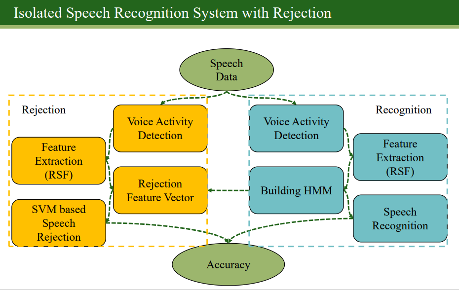
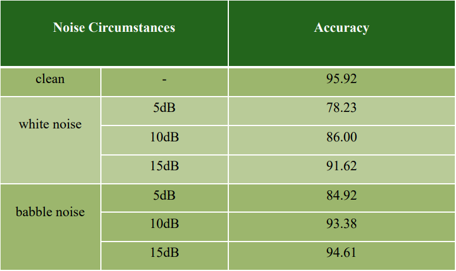

# SVMによる棄却を用いた子供音声のための雑音ロバスト孤立単語音声認識

## 研究背景
現在、ますます多くの子供向け教育アプリに音声認識モジュールが装備されています。この研究は、ノイズの多い環境での音声認識に対するノイズの影響を取り除きます。また、SVMにより、データベースにないデータを識別することによって引き起こされる誤った識別が排除されます。

## システムの構造

### データベース
CIAIR 子供の声データベース (CIAIR-VCV)のデータが使用されています。
データベースを人為的にポジティブな例とネガティブな例に分けます。 ポジティブな例は20ワードで、データベースに事前に保存されており、対応する認識モデルがあります。 26のネガティブな例の単語、これらのネガティブな例の単語には対応するモデルがないため、ノイズ項目です。

### 認識部分

認識の部分は上記の図の通り、最初にデータをVADに渡して、オーディオの両端のミュートされた部分を削除します。 MFCCを使用してオーディオのアコースティックの特徴ベクトルを抽出し、HMM-GMMを使用して特徴ベクトルをトレーニングしてモデルを構築します。
得られたモデルは、テストグループのアコースティック特徴ベクトルとのスィミラリティを計算するために使用できます。

### SVMによる棄却（リジェクション）

1.　リジェクションの必要性　アプリで受信した音声は、データベース内のデータだけでなく、他の言葉も含まれています。 この場合、システムはスィミラリティを比較することによって認識の結果を取得するため、その単語がデータベースに存在するかどうかに関係なく、それでも最高のスィミラリティが得られることになります。ただし、そのような認識は誤りであり、この状況を避ける必要があります。

2.　リジェクションの原理

上記の誤った結果を回避するために、この状況の認識を排除する必要があります。

    rejection feature vector = [L1-L2, L2-L3 , L3-L4] 
    Li represents the i-th largest likelihood

例：
単語Aはデータベースに含まれていますが、単語Bは含まれていません。

    rejection feature vector(A)= [4593.78, 500.65, 89.44]
    rejection feature vector(A)= [400.87, 300.65, 100.45]

明らかに、単語Aのマックススィミラリティと2番目の差は、単語Bのよりも大きいため、データベース内の単語である可能性が高くなります。したがって、SVMによって区別できます。

したがって、このシステムでの正しい認識は、認識された結果が正しいことを満足するだけでなく、音声がデータベースに存在するかどうかも判断する必要もあります。

## 結果

